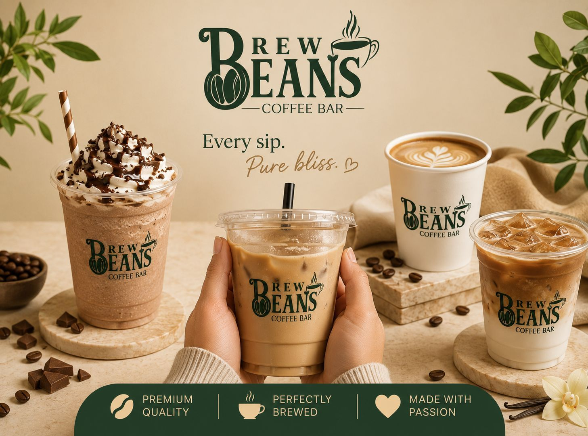

<div align="center">

  

  # ☕ BREWBEANS KARACHI
  ### **Artisan Specialty Coffee Bar, Interactive Digital Studio & Store Operations Portal**

  <p align="center">
    <em>"Where passion meets the bean" — A two-story coffee sanctuary nestled in Gulshan-e-Iqbal Block 2, Karachi.</em>
  </p>

  <p align="center">
    <a href="https://react.dev/"></a>
    <a href="https://developer.mozilla.org/en-US/docs/Web/CSS"></a>
    <a href="https://developer.mozilla.org/en-US/docs/Web/JavaScript"></a>
    <a href="#-mobile-first-responsive-system"></a>
    <a href="https://maps.google.com/?q=plot+num+sb+rab+medical+center+Shop+no+6+Block+2+Gulshan-e-Iqbal+Karachi"></a>
    <a href="https://www.foodpanda.pk/restaurant/zy0t/brewbeans"></a>
  </p>

  <p align="center">
    <a href="#-core-pages--user-journeys">✨ Core Pages</a> •
    <a href="#-mobile-first-responsive-system">📱 Mobile Responsive</a> •
    <a href="#-interactive-custom-brew-studio">☕ Custom Brew Studio</a> •
    <a href="#-direct-checkout--payment-gateways">💳 Online Checkout</a> •
    <a href="#-executive-vip-admin-portal">🔒 VIP Admin Portal</a> •
    <a href="#-quick-start--setup">⚡ Quick Start</a> •
    <a href="#-visit-the-sanctuary">📍 Location & Contact</a>
  </p>

  

</div>

---

## 📖 Executive Overview

**Brewbeans Karachi** is a comprehensive, luxury web application and restaurant operations portal engineered for Karachi’s premier specialty coffee destination. 

Unlike standard static landing pages, this application is a **complete multi-page ecosystem** encompassing direct consumer ordering, an interactive visual espresso customizer, online credit/debit and mobile wallet checkouts, two-story loft table reservations, real-time rider tracking, and an **Executive VIP Store Management Portal** with full inventory CRUD and live sales KPI monitoring.

### 🌟 Key Highlights

| Pillar | Description |
| :--- | :--- |
| **☕ Artisan Menu Catalog** | 20+ signature drinks & bakery treats with authentic photography, categories, dietary badges, and live Sunday 40% OFF discount logic. |
| **🧪 Interactive Coffee Studio** | Animated visual glass cup simulator with dynamic fluid layers (syrup, double espresso, artisanal milks, and mascarpone foam). |
| **💳 Frictionless Checkout** | Built-in direct checkout with **Cash on Delivery (COD)**, **Online 3D Secure Card Gateway Modal**, and **Mobile Wallets (JazzCash / EasyPaisa / Raast)**. |
| **🪑 Two-Story Loft Reservations** | Interactive table booking system for the Ground Barista Bar, 2nd Floor Loft, or Quiet Study Corner with digital confirmation tickets. |
| **🛵 Live Order Tracking** | Real-time 4-step progress stepper with status indicators, barista notes, timestamps, and rider hotline dispatch. |
| **🔒 VIP Admin Portal** | Secured executive management dashboard (`admin`/`brewbeans123`) with live revenue KPIs, order management pipeline, menu CRUD, and table moderation. |
| **📱 Mobile-First Responsive UI** | Custom responsive architecture meticulously audited for iPhone 16 Pro, Android, iPad, and desktop viewports. |

---

## 📱 Mobile-First Responsive System

Every card, navigation header, modal, and drawer is tailored for mobile screens (320px–480px, 768px, 991px, and desktop):

```
┌──────────────────────────────────────────────┐
│  [Logo] BREWBEANS SPECIALTY COFFEE   (🛒1) [≡]│  ← Sticky Header with Dynamic Cart Badge
├──────────────────────────────────────────────┤
│  🔍 Search by drink name or flavor...        │  ← Full-width Instant Search
│  [% Sunday 40% OFF]                          │  ← Streamlined Quick Filters
├──────────────────────────────────────────────┤
│  [All Drinks (20)]  [Frappes]  [Iced Brews]  │  ← Touch Scroll with Hidden Scrollbars
├──────────────────────────────────────────────┤
│  ┌────────────────────────────────────────┐  │
│  │ 🎛️ INTERACTIVE COFFEE STUDIO           │  │
│  │ Craft Your Signature Cup               │  │  ← 100% Mobile-Fitted Studio Card
│  │ Choose espresso pull, milk & foam      │  │
│  │ [ ☕ Build Custom Brew  →            ] │  │  ← Full-Width Tactile Action Button
│  └────────────────────────────────────────┘  │
│                                              │
│  ┌──────────────┐         ┌──────────────┐   │
│  │ [Real Photo] │         │ [Real Photo] │   │  ← Single / Double Column Responsive Grid
│  │ Tiramisu Cup │         │ Spanish Latte│   │
│  │ Rs. 695      │         │ Rs. 540      │   │
│  │ [+ Add]      │         │ [+ Add]      │   │
│  └──────────────┘         └──────────────┘   │
└──────────────────────────────────────────────┘
```

- **Zero Content Blowout:** Fixed flex wrapping and sizing prevent any button or card element from breaking past screen edges.
- **Modern Scrollbar Hiding:** Horizontal category carousels use cross-browser hidden scrollbars (`scrollbar-width: none; ::-webkit-scrollbar { display: none; }`) for fluid native app touch swipe.
- **iOS Safari Optimization:** Form fields enforce `font-size: 16px` to prevent Safari’s automatic viewport zooming.
- **Sticky Order Bar:** Mobile users have quick access to a bottom floating checkout pill showing item count and direct checkout CTA.

---

## 🧭 Core Pages & User Journeys

### 1. 🏠 Homepage (`#home`)
- **Atmospheric Hero:** Authentic storefront photography, gold-trimmed branding, operating hours pill (`Open Now until 4:00 AM`), and dual CTAs for Online Menu and Table Reservations.
- **Social Proof Banner:** Certified 4.9★ Google (85+ reviews) and 4.9★ Foodpanda (269+ reviews) badges.
- **Feature Pillars:** Ethically sourced 100% Arabica, two-story cozy workspace with high-speed Wi-Fi, late night sanctuary, and master baristas.
- **Viral Bestsellers:** Hand-picked showcase of top items (Tiramisu Brew Frappe, Iced Spanish Latte, Lotus Biscoff Cheesecake, Fudgy Cocoa Brownie).

### 2. 📜 Artisan Menu & Order Online (`#menu`)
- Real-time search by name, flavor profile, or ingredient.
- Category filtering: *Hot Espresso & Brews*, *Iced & Cold Brews*, *Frappes & Coolers*, *Artisan Bakery & Desserts*, *Signature Beans*.
- **Sunday 40% OFF Signature Offer:** Built-in calculation engine applying 40% discount across drinks on Sundays or via promo code `SUNDAY40`.

### 3. 🧪 Interactive Coffee Bar Customizer Modal
A visual drink builder featuring:
- **Coffee Base:** Steamed Latte Base, Double Ristretto, Cold Brew, Cloud Flat White, Blended Frappe.
- **Artisanal Milk Selection:** Whole Dairy Milk, Sweet Condensed Milk (+Rs. 80), Barista Oat Milk (+Rs. 120), Roasted Almond Milk (+Rs. 140), Skim Milk.
- **Flavors & Drizzle:** Madagascar Vanilla, Salted Caramel, Belgian Dark Chocolate, Spanish Honey Dulce, Hazelnut Crunch.
- **Signature Toppings:** Mascarpone Foam Cloud, Crushed Lotus Biscoff, Cocoa Dusting, Whipped Cream.
- **Temperature & Ice:** Extra Hot, Normal Hot, Chilled (Less Ice), Iced Refreshing.
- Direct dual action: **Add Custom Brew to Cart** or **Send Spec directly to WhatsApp Barista**.

### 4. 🛒 Slide-Over Cart Drawer & Direct Checkout (`#checkout`)
- Live item counter, quantity increments, item removal, and auto subtotal/tax calculations.
- Promo code input with instant validation (`SUNDAY40`).
- **Comprehensive Karachi Delivery Form:** Customer name, phone (rider WhatsApp), Karachi area selector (Gulshan Block 2, Johar, Clifton, DHA, etc.), complete street address, nearby landmark, and barista notes.
- **Flexible Payment Methods:**
  1. **Cash on Delivery (COD)** — Pay upon doorstep delivery or takeaway counter.
  2. **Online Debit / Credit Card Gateway** — Simulated 3D Secure modal accepting Visa, Mastercard, and UnionPay.
  3. **Mobile Wallets & Raast** — Instant direct mobile transfer via JazzCash, EasyPaisa, or State Bank of Pakistan's Raast ID.

### 5. 🛵 Real-Time Order Tracking (`#track`)
- 4-Stage visual stepper:
  1. **Order Received & Confirmed**
  2. **Barista Pulling Espresso & Assembling**
  3. **Rider Dispatched for Delivery**
  4. **Safely Delivered / Collected**
- Order ID lookup, live simulated progress bar, item breakdown, and direct phone link to the rider/barista hotline (`0311 2463092`).

### 6. 🪑 Two-Story Loft Table Reservations (`#booking`)
- Digital seating selection:
  - **Ground Floor Barista Bar** (Upbeat, espresso aroma, bar stools)
  - **2nd Floor Loft Sanctuary** (Cozy sofas, warm ambient lighting, ambient music)
  - **Quiet Study & Work Corner** (Individual desks, charging power outlets, high-speed Wi-Fi)
- Date picker, guest party counter (1 to 10+ guests), and convenient time slot selector.
- Instant digital ticket generation with a unique booking reference code (`BB-RES-XXXXX`).

### 7. 📖 Coffee Sanctuary Story (`#about`)
- Narrative on Brewbeans Karachi's founding, single-origin roasting philosophy, community vibe, and commitment to the local coffee culture.

### 8. 📍 Location, Operating Hours & Reviews (`#contact`)
- Physical address details in Gulshan Block 2 near Rab Medical Center.
- Live operating schedule: **9:00 AM – 4:00 AM Daily**.
- Verified customer reviews carousel with an interactive form allowing patrons to submit their own 5-star ratings.

---

## 🔒 Executive VIP Admin Portal

Accessible via the navigation menu or direct route `#admin`.

> [!IMPORTANT]
> **Admin Authentication Credentials:**
> - **Username:** `admin`
> - **Password:** `brewbeans123`

```
┌────────────────────────────────────────────────────────────────────────┐
│  ☕ BREWBEANS STORE MANAGEMENT PORTAL            [Live Store Active]    │
├───────────────────┬───────────────────┬───────────────────┬────────────┤
│  TOTAL REVENUE    │  ACTIVE ORDERS    │  TOTAL DELIVERED  │  TABLE RES │
│  Rs. 18,450       │  4 In Progress    │  32 Completed     │  8 Bookings│
└───────────────────┴───────────────────┴───────────────────┴────────────┘
  [ Orders Pipeline ]   [ Table Bookings ]   [ Menu Catalog CRUD ]   [ Reviews ]
```

### Capabilities:
- **Live Sales Analytics:** Real-time calculation of store revenue, order volume, and table reservations.
- **Order Pipeline:** Filter by *All*, *Received*, *Brewing*, *Out for Delivery*, and *Delivered*. One-click order status update triggers live customer tracker updates.
- **Menu Management (CRUD):**
  - Add new specialty drinks, desserts, or seasonal items.
  - Choose authentic image presets or custom paths.
  - Real-time price and Sunday deal toggles.
  - Delete or modify items with immediate client-side sync.
- **Table Booking Moderation:** Confirm incoming seat reservations, view guest counts, and special seating requests.
- **Community Review Moderation:** Review and moderate public customer ratings.

---

## 🛠️ Architecture & Tech Stack

```
brewbeans/
├── public/
│   ├── images/
│   │   ├── brewbeans_banner.jpg      # Official Storefront & Ambience
│   │   ├── brewbeans_logo.jpg        # Brand Crest Logo
│   │   └── real/                     # Authentic Photography Assets
│   ├── favicon.ico
│   ├── favicon.svg
│   └── index.html
├── src/
│   ├── components/
│   │   ├── Navbar.js                 # Responsive Nav + Dynamic Badges
│   │   ├── Hero.js                   # Visual Sanctuary Hero
│   │   ├── Customizer.js             # Interactive Cup Simulator Modal
│   │   ├── CartDrawer.js             # Slide-Over Basket Drawer
│   │   ├── LocationHours.js          # Google Maps & Contact Card
│   │   ├── ReviewsSection.js         # Community Feedback Carousel
│   │   ├── CafeVibe.js               # Atmosphere & Features
│   │   └── Footer.js                 # Socials & Legal Footer
│   ├── pages/
│   │   ├── HomePage.js               # Main Landing Experience
│   │   ├── MenuPage.js               # Artisan Menu Catalog & Filters
│   │   ├── CheckoutPage.js           # Multi-Payment Direct Checkout
│   │   ├── TrackOrderPage.js         # Live Delivery Stepper
│   │   ├── BookingPage.js            # Table Reservation Loft
│   │   ├── AboutPage.js              # Brand Heritage & Philosophy
│   │   ├── ContactPage.js            # Location & Hours View
│   │   └── AdminPage.js              # VIP Executive Operations Portal
│   ├── data/
│   │   └── coffeeData.js             # Initial Menu, Reviews & Metadata
│   ├── App.js                        # Master Application State & Router
│   ├── App.css                       # Complete Luxury Design System & Media Queries
│   └── index.js                      # React Root Entrypoint
└── README.md
```

### Technology Highlights:
- **Core:** React 18, JSX, Functional Components & Custom Hooks (`useState`, `useEffect`, `useCallback`).
- **Styling:** Pure CSS3 Architecture with extensive custom properties:
  - `--bg-body-dark: #0f0d0b;` (Deep espresso charcoal base)
  - `--accent-gold: #e2b078;` (Warm crema gold accent)
  - `--accent-gold-hover: #c99355;`
  - `--bg-surface-card: #171410;`
  - Glassmorphic backdrops, smooth cubic-bezier transitions, and elevated drop shadows.
- **Data Persistence:** Integrated HTML5 `localStorage` persistence layer ensuring that cart items, newly created menu drinks, updated orders, table bookings, and customer reviews persist seamlessly across browser sessions.
- **No Heavy Third-Party Bloat:** Handcrafted lightweight SVG icons, zero bulky UI library overhead, resulting in blistering fast LCP and INP performance.

---

## ⚡ Quick Start & Setup

### Prerequisites
- [Node.js](https://nodejs.org/) (v16.x or newer recommended)
- `npm` (v8.x or newer) or `yarn`

### 1. Clone Repository
```bash
git clone https://github.com/Jasir-ali90/Brewbeans.git
cd Brewbeans
```

### 2. Install Dependencies
```bash
npm install
```

### 3. Launch Development Server
```bash
npm start
```
The application will automatically start and open in your default browser at:
`http://localhost:3000` (or `http://localhost:3008` / `http://localhost:3009`).

### 4. Create Production Build
```bash
npm run build
```
Generates an optimized, minified production build in the `build/` directory ready for deployment to Vercel, Netlify, or GitHub Pages.

---

## 📍 Visit the Sanctuary

<div align="center">

| Detail | Information |
| :--- | :--- |
| **📍 Address** | Shop #6, Plot SB 1/SB 2, Rab Medical Center, Block 2 Gulshan-e-Iqbal, Karachi, Pakistan (75300) |
| **🕒 Operating Hours** | 9:00 AM – 4:00 AM (Open Daily, Late Night Specialty Haven) |
| **📞 Barista Hotline** | [+92 311 2463092](tel:+923112463092) / `0311 2463092` |
| **💬 WhatsApp Orders** | [Chat on WhatsApp](https://wa.me/923112463092?text=Hello%20Brewbeans!%20I%20would%20like%20to%20place%20an%20order.) |
| **🛵 Foodpanda** | [Order on Foodpanda Pakistan](https://www.foodpanda.pk/restaurant/zy0t/brewbeans) |
| **📸 Instagram** | [@brewbeans.karachi](https://www.instagram.com/brewbeans.karachi/) |
| **👍 Facebook** | [Brewbeans Karachi Official](https://www.facebook.com/brewbeanskhi/) |

</div>

---

<div align="center">
  <p>Crafted with ☕ and passion for <strong>Brewbeans Karachi</strong>.</p>
  <p><sub>© 2026 Brewbeans Specialty Coffee. All rights reserved. Open-source under the MIT License.</sub></p>
</div>
